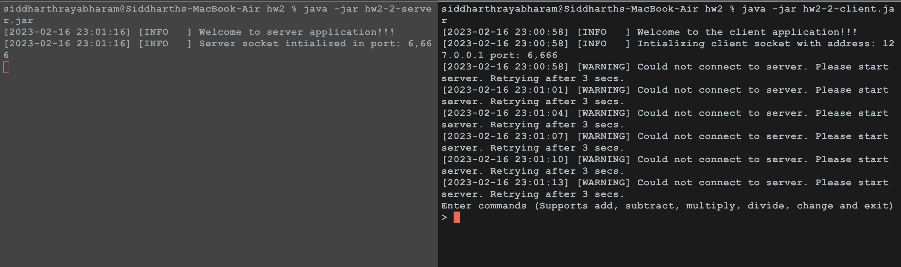
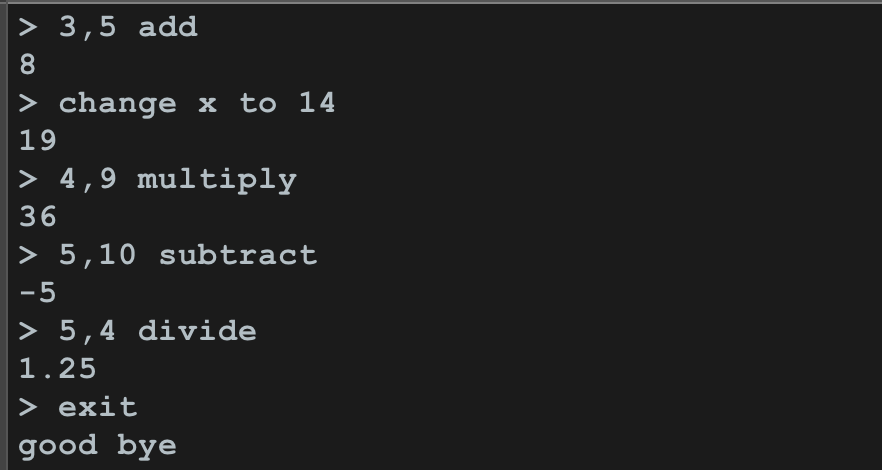
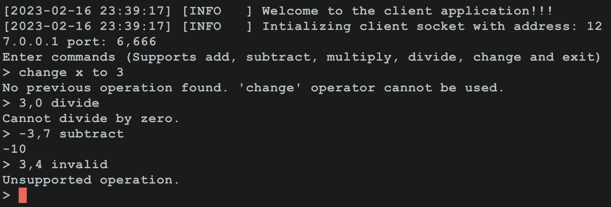

# COMP512 Advanced Operating Systems

# Instructor: Dr. Truong Tran

# Submitted by: Siddharth Rayabharam (nqr5356)

# Homework 2


## Question 1

To run the code for question1. Use the below command

```
java -jar hw2-1.jar
```
### Description

The source code consists of three class: Main, Parent and Child. The Main class creates Parent and child thread instances and waits for these two to complete running. The Main class has a global pipe which is used by both Parent and Child.

The parent thread first takes the sink channel of the pipe and writes the data `COMP 512 pipe programming parent` and listens to the source channel of the pipe for the child to write back data. After it receives the data in the pipe, it displays that message and exits

The child thread reads the data from source channel  of the pipe and changes the case and adds "CHILD" at the end. The resulting message is `comp 512 PIPE PROGRAMMING PARENT CHILD`. This message is written into the sink channel of the pipe. Once the message is written, the child also exits.

### Screenshots


## Question 2

To run the code for the question 2. Please use the below commands seperately in their own terminal

**Client**
```
java -jar hw2-2-client.jar
```

**Server**
```
java -jar hw2-2-server.jar
```

### Description

#### Server

Server starts a socket at 127:0:0:1 (localhost) in the port 6666. The server receives the message and parses the command. Based on the command, the server evaluates the response for the client and sends the message to the client.

#### Client

Client connects to the server with the given IP Address and port. Once the client connects to the server, it provides option for the users to enter command. The entered commands are sent to the server and waits for the server to respond.

#### Screenshots

1) **Connection** : Client retries every 3 sec till the server opens up the socket. Server starts up and opens the socket for the client to connect.



2) **Commands** : The client sends add, subtract, multiply, divide, change and exit



3) **Edge cases**: Negative numbers, Division by zero and invalid commands handled



